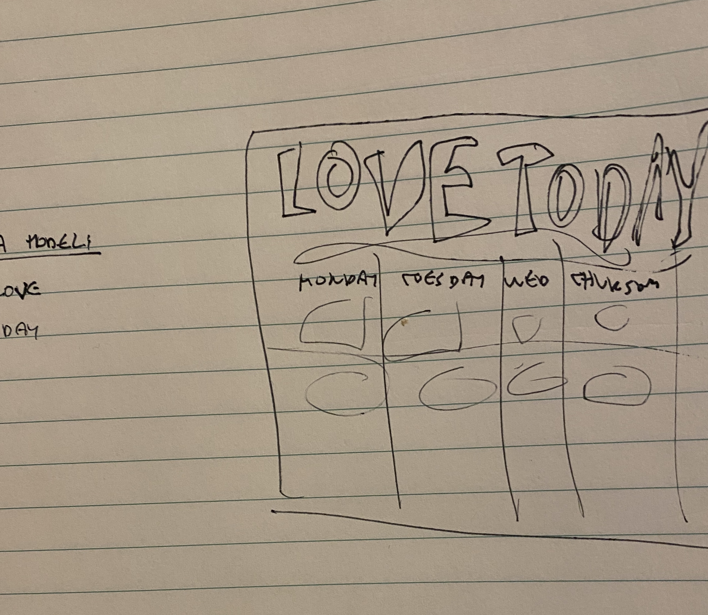
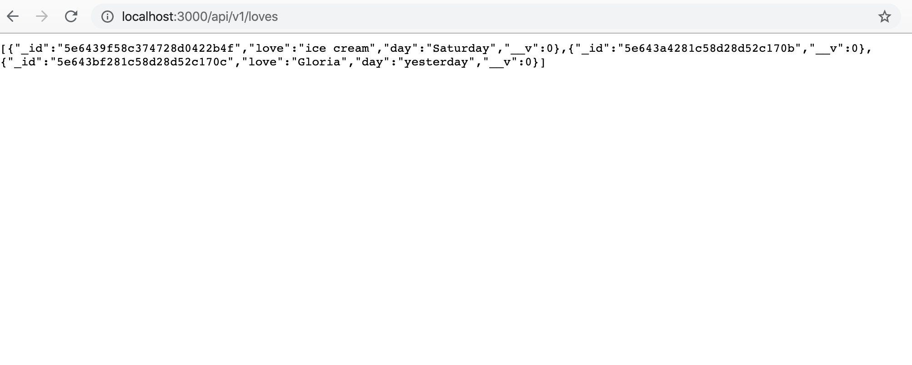
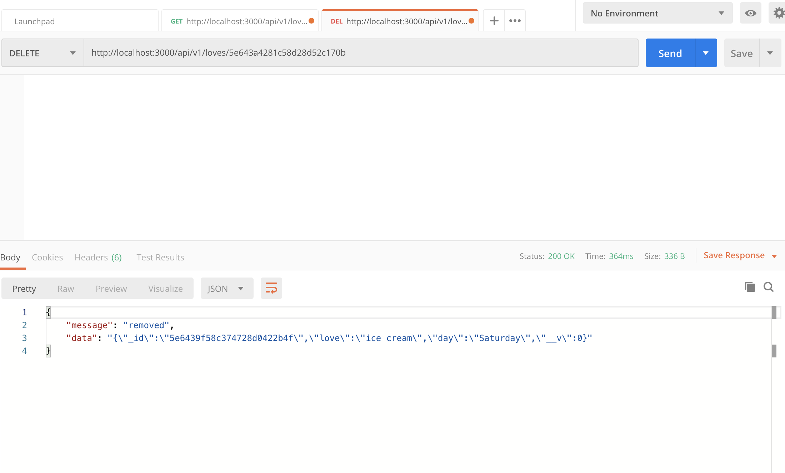
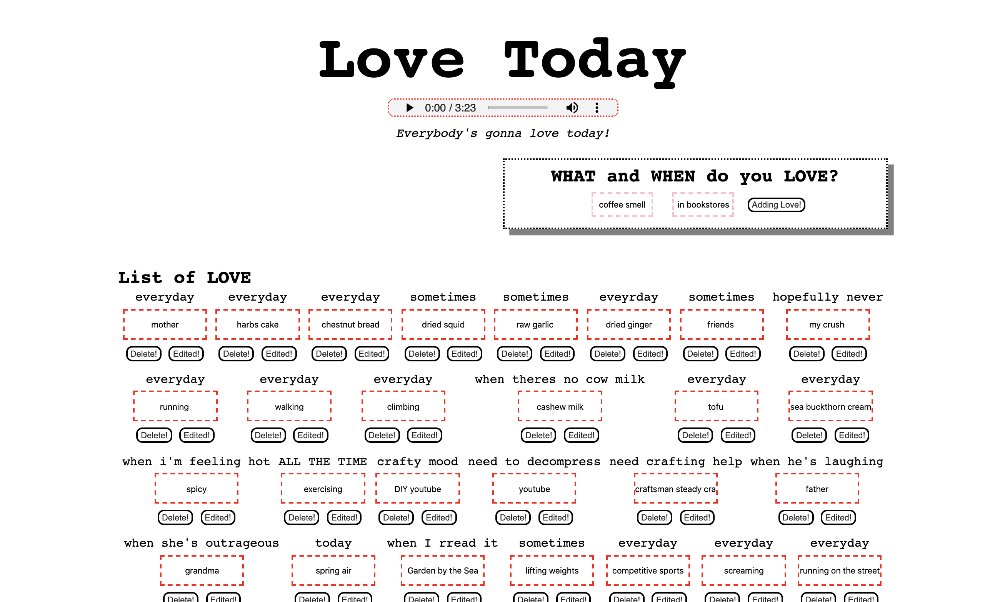

# Assignment 5 + Final Proposal 

## Design and Interface
I wanted to prioritize solidying the stuff we did last Monday because I got stuck making POST requests and using Postman during class. Following the MongoDB Guide from the readings, I redid everything we did in class except with different names. I decided to go with the theme of Love/things that make me happy, which I attempted to do in last week's assignment. 

I decided to specifically hone in on love after listening to [Mika's song, Love Today](https://www.youtube.com/watch?v=AWiccrTB4LM). Since it put me in such a good mood I wanted to add it to my page. I realized I'm not very good at following my own plans so I made a very loose sketch to just plan out where I want the elements to be. I also decided I wanted more "romantic" colors like red, pink, black, and grey as a color scheme. 

I did not fully consider what I'd do with the love information as I wanted to focus on how I could work with it, but it is something I'd like to explore in the final. 

For the data model, I just wanted to have what I was feeling love towards and when, which can be taken loosely. 

## Development 
Since we went over the process in class and all the steps were laid out in the MongoDB Guide, I was able to have smoother sailing with the mongoDB stuff and was excited to see information being posted!

Once I got that to work I tried it through Postman, which I thought was very cool. Everything seemed to move like magic!

### Difficulties
I had a version that looked exactly like the example code in the guide, and everything worked well functionally. However, after I started to make some changes I could not get the DELETE or PUT requests to work properly. The DELETE would delete either the first list item or the one before it, while the PUT request would not work at all. I attempted to figure it out by changing the child element segment and switching around variables but could not figure it out. 

### End Result
Below is the final result. 

## Deployment
[Glitch Assignment 5 Link]()

## Final Proposal 
For the final I would like to continue working on this week's assignment. I would like to figure out to get the PUT and DELETE requests working properly, but I don't think I will want to delete any of my inputs. 
I also want to consider how I can organize and display this information. 

One thought is adding an actual date category and organizing by it like a diary. 

Another one I thought of was putting words together randomly like a poem. 

The last one I thought of was including a dropdown selection of a category and having the displayed items "animate" depending on what type of thing it is. For example, if it's something related to food the item will expand and if it's related to family the item will vibrate. 

I may want to try implementing one or more of these things and experiment with seeing what looks best. 