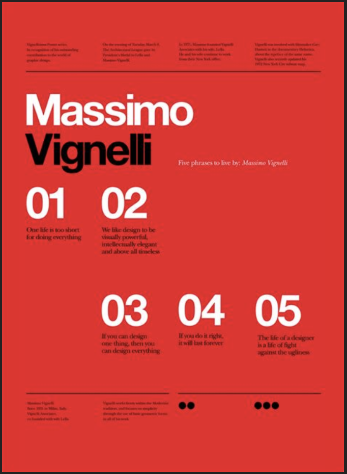
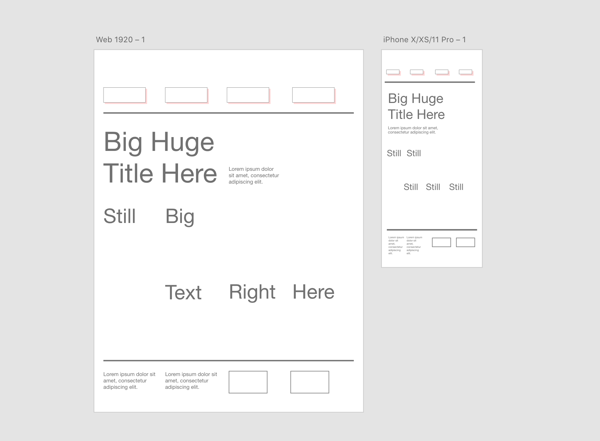
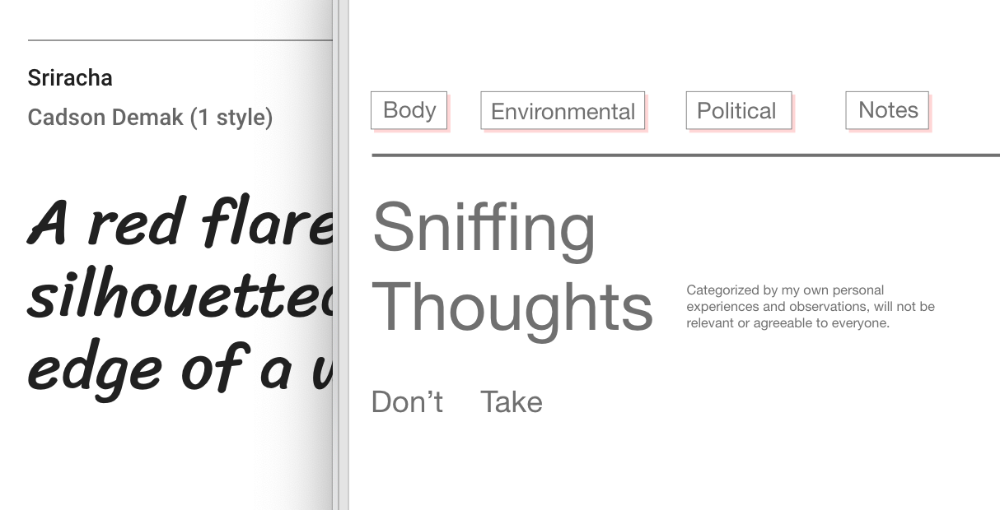
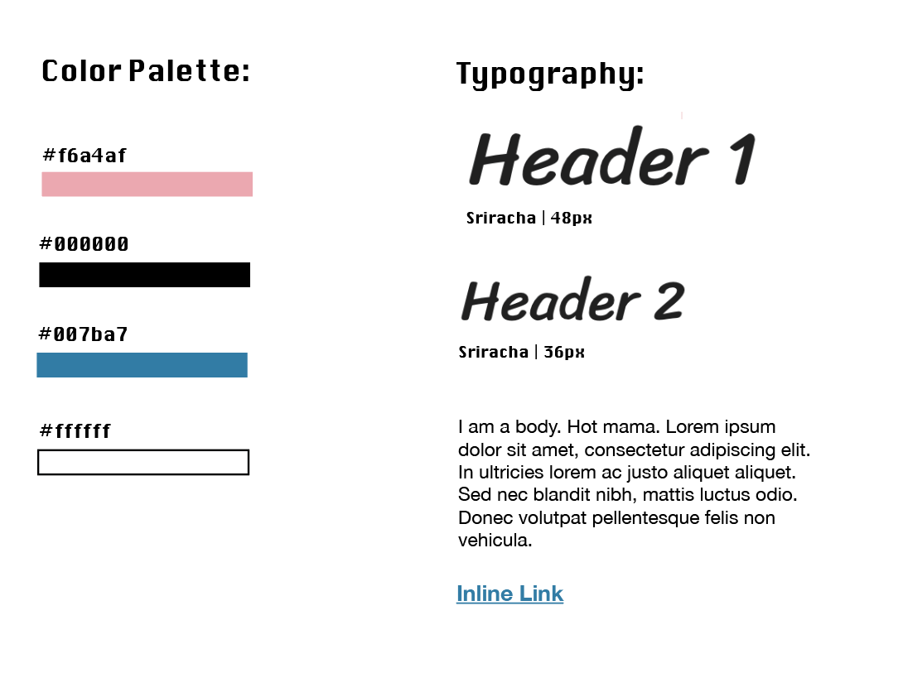
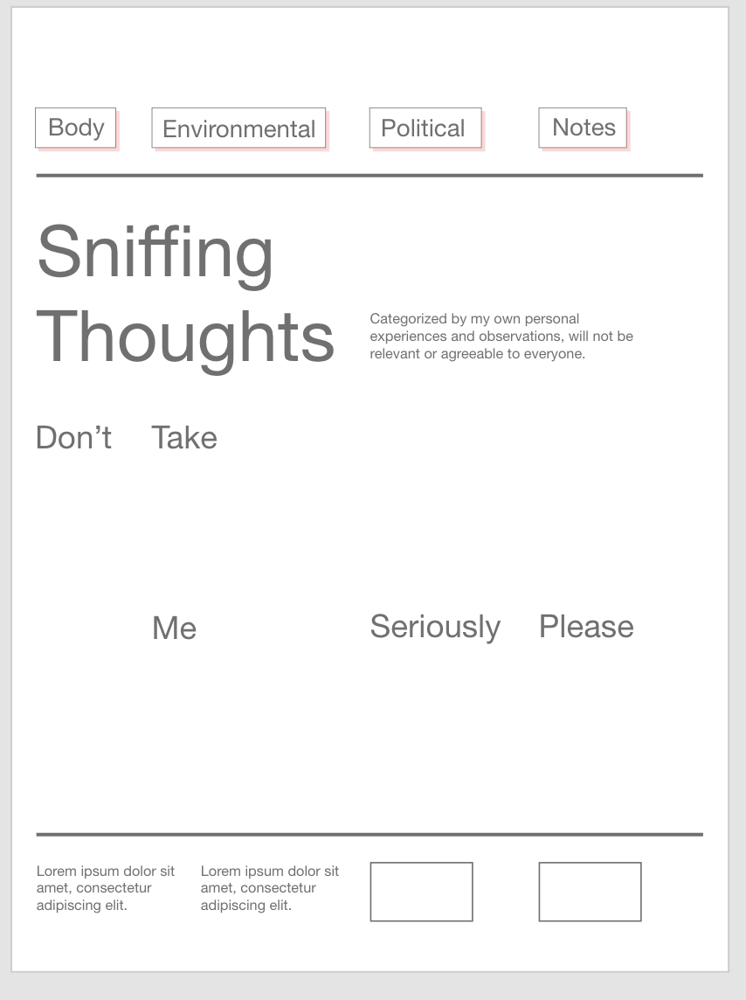
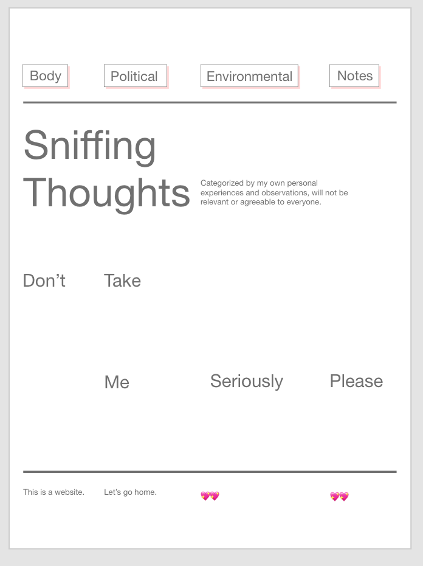
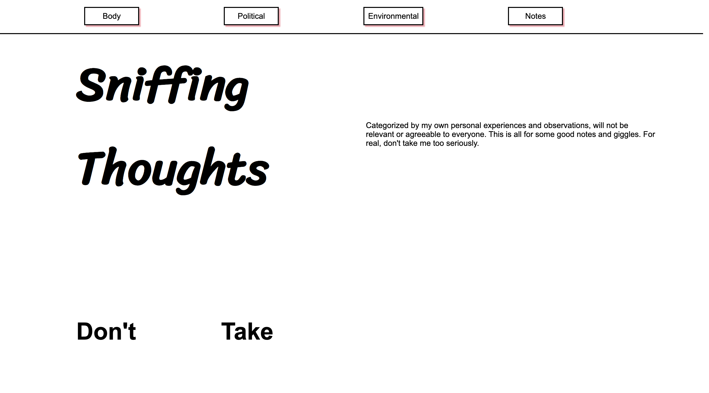
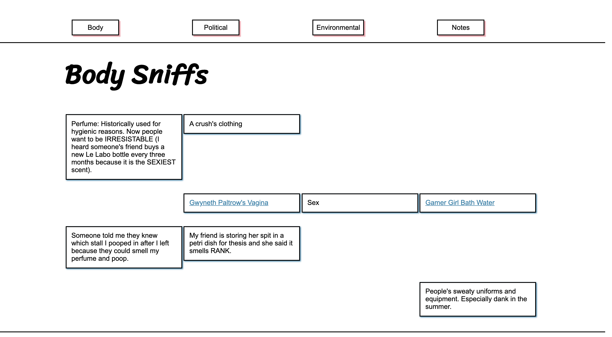
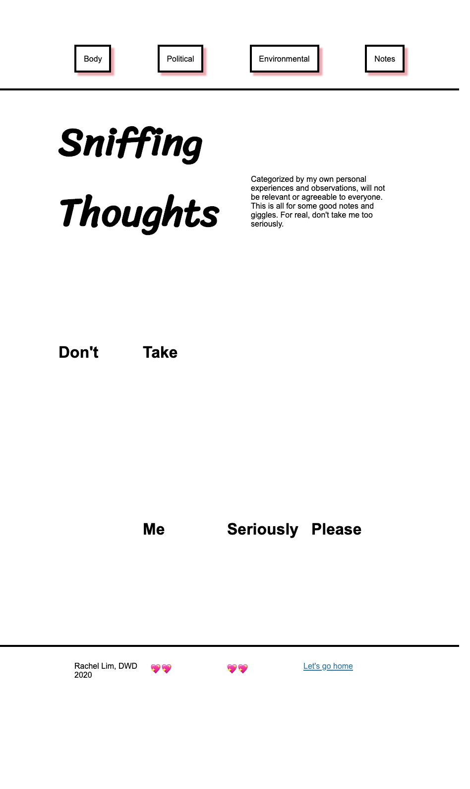
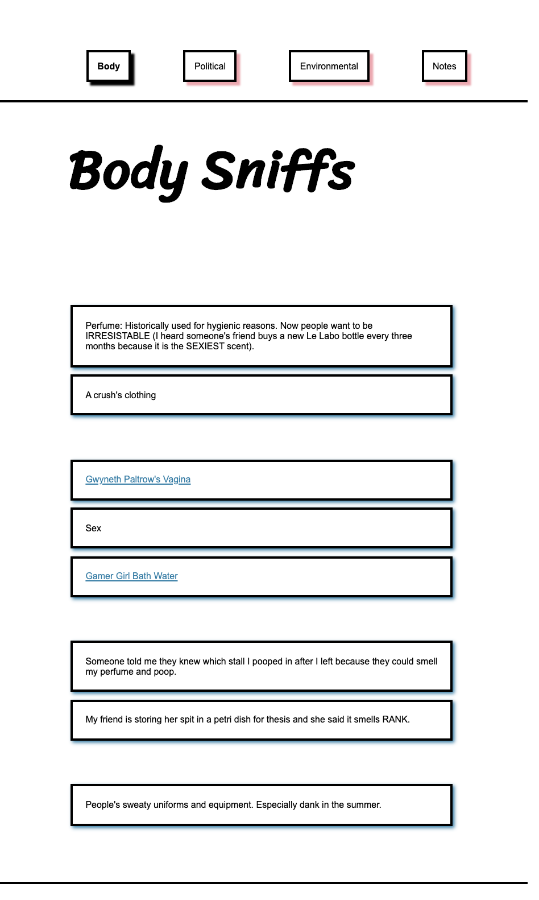

# DWD: Week 2 Assignment 

## Sketch, Wireframe, Design Process
### Poster
For this assignment I chose the poster below: 


### Content 
For the content, I decided to keep the scent stuff I created for the last assignment. 

### Sketch 
I initially misinterpreted the assignment as just re-creating the poster so in the version 1 sketch I just laid out all the poster elements. During this sketch I noticed that the designer placed the elements according to quarter points of the page.  When I realized this poster was more of a compositional guideline, I created the verson 2 sketch with dividing the page into quarters in mind. The left is how I imagined the landing/home page to look and the right is one of the navigation pages. 


### Wireframe
For the wireframe I used Adobe XD because it is on my computer. I have never used this type of program before so I initially had some difficulty placing shapes onto the page. I tried to follow the quarter grid layout from my sketch while playing around with sizing, placement, and colors. After finalizing that I created a mobile version, which I intended to just be a smaller version of the web one.


### Style Guide
For the style guide I decided to use inDesign to put everything together. Overall I wanted to keep everything simple, but I knew for my header fonts I wanted to use [Sriracha](https://fonts.google.com/specimen/Sriracha). However, I did not know how to place a Google Font I wanted into inDesign, so I did a side by side comparison of my wireframe font and my desired Google Font to see if they were compatible. 


After deciding that Sriracha was the one I wanted, I took some screenshots of it and plopped them into my style guide. I did not want to have too many restrictions or specific, complicated elements so I just put the desired fonts and colors. (I just realized that the body font name is missing, but it is just Helvetica.)


### Design
For the design I just spruced up the wireframe I created earlier since I did not plan to have any dramatic changes from it in the final appearance. After placing in the actual text I planned to have, I tried re-arranging some elements that felt awkward to me, such as the placement of "Environment" the navigation menu. 


In the finalized version I switched around "Environment" and "Political". Even though there is not much of a difference I felt better seeing them in this order than the one in the other photo. 


## Development Process

### HTML
For the HTML I mostly followed the workbook layout we created during class. I created five pages (index, body, environment, political, notes).

### CSS 
For the CSS I created two files: a main file for the index page, and a pages file for the others. I created two separate ones because I realized I wanted the main body portion of the other pages to have different classes from the index one. I included both the main and pages css file on those pages because I wanted to retain the navigation/footer format on the main one. I am not sure if that is they way it should be done or not. 

I also mostly followed the class names and layout we created from the workbook practice in class, except re-formatting it to have a quarter grid layout. However, for the other pages I wanted my page items (the text in the boxes) to have a tighter border around the text, so I tried to play around with the margins in the pages.css file to push the borders back. However, it did not work without pushing the elements out of their quarter grid layout so I gave up and commented it out (shown below). 

```css
/* trying to change width of page item without making the border look funny */
/* .left__text:not(:first-child){
    margin-right: 15%;
}
.right__text:not(:last-child){
    margin-right: 13rem;
} */
```

The pages with the HTML and CSS sort of resemble my wireframe. I did not realize how spacious web pages actually were, so the elements are much more spaced out compared to my wireframe. 



### Javascript 
We did not have time to go over Javascript in class but I placed one onclick() function that would change the landing page title to blue. I also included an onload() function to console log that the window has loaded. 

### Responsiveness
For responsiveness I placed the @media screen underneath the larger class elements, such as header, main, and footer. As I wanted the landing page to be a mini web version page, I did not change much besides decreasing the padding size, font size, and view heights.


For the content/navigation pages, I did not decide to keep the grid layout and had the main elements laid out in a column and changed their widths to 100%. However, the navigation and footer elements still retained their quarter grid layout. 


## Glitch Deployment
[Glitch Project Link]()

